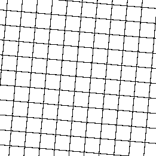
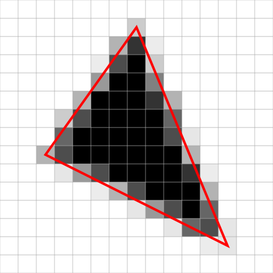
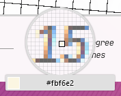

## **Preamble**
As this is my first post I thought that I would start with something relatively simple. Given that I am currently
building this site and being an engineer I don't have much in the way of images. In pursuit of visual appeal and
interest I have therefore made use of gradients throughout this site and as such, I take this opportunity to look
deeper into how they work and behave in CSS, thereby keeping a record of what I have learnt about them.

## **Introduction**
### **Positives**
Gradients are a transition from one colour to one or more other colours over some distance. So why are gradients
interesting? For a start when used as backgrounds they can bring more visual depth and texture than their flat
counterparts. Creating visual depth can help to break up content, making it more approachable and therefore consumable.
Appropriate use of gradients can also be used to draw attention to key content by making it more stimulating while
intelligent use of light may subtly direct visual tracking of a page. Gradients can also be a great alternative to 
images as they generally cost far less to produce or acquire yet still introduce a personal touch or branding element as 
applicable. Logos commonly make use of gradients; this is probably because gradients imbue more personality than flat 
colour while still being sufficiently simple to be recreated faithfully at small sizes.

### **Negatives**
Gradients do also have their downsides. As much as they can draw attention to key areas and help to contextually
separate content when used well, they can also be distracting and divert users away from key content. In addition
gradients _can_, but do not necessarily need to, cause problems in terms of accessibility. Much the same as with text 
over images, text over gradients can often cause readability issues. These readability issues often arise from a lack of
contrast between the text/foreground colour and the colour of the background over which it is presented. Unfortunately
this is still a common issue on the web even when using flat colours, let alone when text is displayed over a background
that has multiple colours such as an image or gradient. With a little thought and a modicum of effort though there is
usually ample opportunity to improve the situation for everyone!

***

_It has been fairly widely acknowledged that the web needs to be more accessible to all users as accessibility
benefits, everyone often in ways that are not immediately obvious. As a Frontend engineer and someone who spends most of
their time working to create user interfaces, I want to ensure that accessible practices are always considered. I am
very much at the start of the journey towards incorporating accessible practices as a default as opposed to
retrospectively, but hopefully with a little learning, a little feedback and some time I will get there._

## **Basic varieties**
As touched upon earlier in this post in the context of CSS gradients, a gradient is a transition from a colour to one or
more other colours over a specified distance. What was not discussed at that point was the direction of that 
transition. In gradients generally that is not important however in CSS gradients there are currently 6 varieties of 
gradient which can be divided into 3 categories:

 - **Linear**
   CSS `linear-gradient`s can be thought of as being unidirectional, as in they transition from a start point to an end
   point along the straight line that connects them. 

 - **Radial**
   CSS `radial-gradient`s can be thought of as being omnidirectional, as in they transition from a start point in all
   directions up to a specified distance from the start point.

 - **Conic**
   CSS `conic-gradient`s vary from the other 2 varieties in that they do not transition along (a)
   straight line(s). Instead they transition from a start angle to an end angle about a specified point.
   (`conic-gradient`s are a newer addition to the CSS specification and therefore not implemented in some commonly used
   browsers. Consequently this post will focus more on the other two categories.)

Each of the above categories have a default and repeating variety. The total span of the gradients produced by each
variety of a category will be the same, however, a repeating variety will likely contain multiple instances of the same
transition whereas the default variety will only contain one instance. It is worth noting that a _transition_ here can
contain multiple `color-stop`s and `color-hint`s that will add colours to the transition, i.e. a single transition could
go from purple to yellow via orange, red and magenta. At this point it is probably worth looking at some examples.

## **Linear Gradients**
Below is probably the simplest declaration of a gradient in CSS. It declares a two colour gradient (the minimum
required) without an `angle` or positions for the `color-stop`s. In the case where a direction is omitted, the
[specification](https://www.w3.org/TR/css-images-3/#linear-gradient-syntax) states that it defaults to '`to
bottom`'. Similarly, if positions are not declared for the first and last `color-stops` the
[specification](https://www.w3.org/TR/css-images-3/#color-stop-syntax) states that their positions should default to 0%
and 100% respectively. It also states that when one or more `color-stop`s which are not the first or last and their
positions are omitted, then they are spaced evenly between the surrounding positioned `color-stops`.

To view and interact with the source declaration click the _"Open Editor"_ button.

```css showcase caption=Simple_Gradient
/*----------------------------------------------------------------------------*\
 *
 * The declaration of the `background-image` CSS property that results in the
 * accompanying two tone gradient.
 *
 * Try changing the `color`s to something different, for example: `grey`,
 * `green`, `#57316b`, `hsla(352deg 68% 59% / 80%)` etc.
 * 
 * Alternatively add a new `color-stop` - a `color` followed by a comma unless
 * it is the last in the list.
 *
\*----------------------------------------------------------------------------*/
background-image: linear-gradient(black, white);
```

In an effort to keep this post focussed, while other CSS properties have been applied to the preview they are not shown
in the _"source"_, they only serve the purpose of giving the preview a size and fitting it in with layout of this page.
A `selector` is also used to target the `class` `attribute` of the preview `element`. The `declaration`s shown in the _"source"_ are
inserted into the CSS `rule` that targets the preview's `selector`. For context the snippet shown below is what has 
already been applied to the preview element:

```css
/*----------------------------------------------------------------------------*\
 *
 * The actual class name is generated by the `CSS modules` package, so here it
 * has been replaced with "preview". This is shared across all the previews.
 *
\*----------------------------------------------------------------------------*/
.preview {
  position: absolute;
  top: 0;
  left: 0;
  right: 0;
  bottom: 0;
}

/*----------------------------------------------------------------------------*\
 *
 * As the showcased styles from each example are unique, the preview element has
 * an id attribute which is used as the selector for the inserted styles. This
 * selector also includes a generated hash so for the purposes of this is
 * replaced with "preview". The "#" denoted that it is the value of an id
 * attribute.
 *
\*----------------------------------------------------------------------------*/
#preview {
  /* inserted styles */
}
```

### **_A picture is worth a thousand words_**
&hellip;or so the adage goes. Ideally the gradient pictured above will have been the expected result, given the information
in this post so far, and if not hopefully it has brought some clarity. With the visual aid of the above example it may
be easier to go over how the transition from one colour to the next is resolved.

## ** A deep dive**
### **All the colours of the rainbow&hellip; well almost!**
So we probably need to talk about colour representation in browsers. To make the web more accessible there are a number
of `color` name `keyword`s. These are more memorable shorthand forms that will resolve to a particular `color` value in
`sRGB` `colorspace` <sup>1</sup>. This means that it is possible to set a `color` to be `red`, `coral`, `purple`
etc. and the browser will know what to display, however, there are only a finite number of these (140 in fact and they
are pre-defined which is quite limiting &mdash; the web would be rather homogeneous if we could only use 140 colours!) 

So what did that `sRGB` `colorspace` bit mean? There are many ways of thinking about colour, but one that lends itself 
to being displayed on a screen is to think of a colour as being made up of different amounts of coloured light. For 
example if we start with a scene with no light then the colour of the scene is black, if we were to shine a red light on 
the scene the colour of the scene would become red. If we additionally shine a green light in equal amount to the red 
light on the scene it would result in a yellow colour. Finally if we were to shine a blue light on the scene as well, 
the scene would appear illuminated with white coloured light. By varying the amounts of these three coloured lights we 
can make the scene almost any colour required. This type of colour system is called "additive" in contrast to paint or 
ink based colour systems which are called "subtractive" &mdash; adding dye or pigment filters out light. Returning to 
`sRGB`, if we now expand the acronym to the full name `standard Red Green Blue` `colorspace` the reason for choosing 
red, green and blue light in the earlier thought experiment may become apparent.

<aside>

As a side note the reason for red, green and blue being used as the _primary colours_ is purportedly related to the 
types of cone cells there are in the human retina, and the colour of the light they are most sensitive to. The last 
thing to address is the `standard` part of `sRGB`, it is important not to skip over this as it reflects that `sRGB` is 
device-independent, so regardless of a devices capabilities provided that it is `sRGB` capable it will display the same 
colour. How does all this relate to gradients? We now know that we can represent colours as a list of amounts of red, 
blue and green light, amounts otherwise known as _'channels'_. For example `red: 50%, green: 60%, blue: 70%`.

</aside>

<small>

<sup>1</sup> At the time of writing Lab and LCH colour spaces have been defined in the CSS `color` level 4 specification
but are yet to be implemented in any widely used browsers.

</small>

### **Walking the line**
Having discussed colour representation we should probably get back to `linear-gradient`s. Since **fig. 1** is one of the
most straightforward examples of a gradient let's take that as a starting point. The actual size of the preview gradient
will vary depending on the device it is being viewed on but if we think of it as being 100 pixels in height it will
help. To summarise the gradient we are considering has a direction of `to bottom` with a start colour of `black` at the
default position of `0%` and an end colour of `white` at the default position of `100%`. Let's consider how this will 
get displayed on our screens, starting with the first row of pixels. Given that this is the first row of pixels in a
gradient that is 100 pixels high the top of the row is offset 0 pixels or 0% from the top and the bottom of the row is
offset 1 pixel or 1% from the top. As each pixel can only be painted one colour we need to find the average colour for
this section of the gradient line. We also know that all the pixels in this row should be the same colour because the
row is perpendicular to the `gradient-line` and therefore every pixel in this row is the same distance along the
`gradient-line`. This holds true for subsequent rows as well. Since this is a `linear-gradient` we know that there is a
linear relationship between the displacement along the gradient line in pixels and the percentage _colour shift_; in
fact as we are considering a 100 pixel gradient they are directly proportional meaning for each pixel of displacement
along the `gradient-line` the _colour shift_ increases by 1%. Therefore we know that average colour of a row will
be the same as that of the theoretical `gradient-line` at the pixel row's vertical **midpoint**.  For the first row of
pixels this will be at &frac12; a pixel along the gradient line. We now also know that colours can be represented
numerically, which makes transforming and scaling them much easier. For instance `black`, the starting colour of our
gradient, can also be described as `rgb(0, 0, 0)` (0 red light, 0 green light and 0 blue light) and the ending colour
`white`, as `rgb(100% 100% 100%)` &mdash; more commonly written `rgb(255, 255, 255)`. There is also a similar, commonly
used, more concise way of describing `RGB` colours using a triplet of 2 digit hexadecimal numbers written in the form
`#RRGGBB`, in the case of `black` this is: `#000000`. In our example a &frac12;% shift from `black` to `white` would be
`rgb(0.5%, 0.5%, 0.5%)` which seems fairly straightforward.

To make matters a little more complicated most devices will display 24-bit or "true" colour, this means that the device 
can display 256 increments (0 - 255) of colour in each of the three channels. The channels are then blended together to 
create the colour that is displayed on the screen, so there are many more colours than the 256 available in each 
channel. If you are familiar with permutations in mathematics you will know that when repetition is permitted (which for 
this application it is) the formula to get total number of permutations is $k^n$ where $k$ is the number of elements in 
a set of options and $n$ is the number of choices to be made from that set. Therefore the total permutations of colour 
is 256<sup>3</sup>. 256 can also be written as 2<sup>8</sup>, so the number of permutations can be written as 
(2<sup>8</sup>)<sup>3</sup> and then simplified to <abbr title="16,777,216">2<sup>24</sup></abbr> &mdash; which is why 
it is called 24-bit colour, as it takes 24 bits of memory to store the colour data.

The reason for this tangent is that if we now go back to the colour of the first row of pixels which we worked out 
should be the colour `rgb(0.5%, 0.5%, 0.5%)` and remember that there are 256 available increments in each channel 
starting with 0, we may realise that we have encountered a problem! The problem being, albeit not an insurmountable one, 
that 0.5% of 255 is 1.275 and this is not one of the 256 increments available, as such it needs to be rounded to the 
nearest increment. The good news is that we have finally established what colour the first row of pixels in our gradient 
should be painted: `rgb(1, 1, 1)` or `#010101` and not only that but also a methodology for doing the same for 
subsequent rows. For example, the second row, is offset 1 pixel more than the first but in all other dimensions is the 
same. So the midpoint of the second row will also be offset 1 pixel from the first row's midpoint, 1&frac12; pixels 
along the gradient line. Applying the same process as last time we get 1.5% of 255 = 3.825 and rounded 4 giving a colour 
of `rgb(4, 4, 4)` or `#040404`. 

While we have covered this from the perspective of a linear gradient it is actually the same process for 
`radial-gradient`, just rather than observing sequential line's of pixels (rows was a special case) we would observe 
sequential concentric ellipses or circles from the central pixel outwards. Likewise for `conic-gradient`s it is the same 
process from a different perspective; this time we observe sequential _rays_ or _sectors_ (angular divisions) about 
a central point. 

### **Let's get mathematical**
The methodology we just discussed is actually quite common and known as linear interpolation. It is often used for
curve-fitting to find an estimate for a value between two known points: $(x_{0},y_{0})$ and $(x_{1}, y_{1})$, these actually map
to the `color-stop`s in gradients. The $x$ values relate to the `color-stop`'s position and the $y$ values to the
`color-stop`'s colour.  Additionally as these are *linear* gradients, linear interpolation will give an exact value as
opposed to an estimate.  The formula is as follows:

$$
{\displaystyle y=y_{0}+(x-x_{0}){\frac {y_{1}-y_{0}}{x_{1}-x_{0}}}}
$$

This will need to be applied per channel.

Now at a glance that can seem quite daunting, so let's try to break it down a bit. Working from left to right, $y$ is 
the colour that we are trying to find at a position ($x$) on the `gradient-line`, which we will input into the formula.  
$y_{0}$ this is the start value for a channel for the start colour of our gradient `black` that is 0 for all 
channels. To that we are then adding $(x-x_{0})$, the difference between the _input_ position and the _start_ position, 
and for us this is the same as the _input_ position since the _start_ position is 0. This is then multiplied by the 
difference between the _end_ colour channel value and the _start_ colour channel value divided by the difference between 
the _end_ position and the _start_ position. As we know already both the _start_ colour channel value and _start_ 
position is 0, so this is just the ratio of the _end_ colour channel value to the _end_ position. To obtain the 
percentage value for the colour channel the ratio is 1:1, so for this specific case the formula collapses:

$$
{\displaystyle y=0+(x-0){\frac {100-0}{100-0}}}
$$

$$
{\displaystyle y=x}
$$

To get the colour channel value instead is very similar:

$$
{\displaystyle y=0+(x-0){\frac {255-0}{100-0}}}
$$

$$
{\displaystyle y={\frac {255}{100}}x}
$$

That was an implementation that was manufactured for convenience though. So let's have a look at using the formula with
some arbitrary colours (`mediumspringgreen` (`#00fa9a`) and `mediumpurple` (`#9370db`) for example) and find the 
midpoint colour.  To start with let's convert the hexadecimal values to decimal so that they're a bit more 
readable. Just as binary is base 2 (0 to 1), octal base 8 (0 to 7) and decimal base 10 (0 to 9), hexadecimal is base 16, 
however, given that there are only ten Arabic numerals (0 to 9) different symbols are required to represent the numbers 
ten to fifteen; conventionally the letters "a" to "f" (case insensitive) are used for this purpose. For 
`mediumspringgreen` we have `00`, `fa` and `9a`. `00` is nice and straightforward it's still 0. `fa` written literally 
in decimal form would be 15 10, given hexadecimal is base 16 that equates to 15 &times; 16 + 10 = 250 in 
decimal. Similarly `9a` is 9 &times; 16 + 10 = 154.  Meaning we can use the rgb value of `rgb(0, 250, 154)` for 
`mediumspringgreen`. Applying the conversion to `mediumpurple`'s hexadecimal values `93`, `70` and `db` gives `rgb(147, 
112, 219)`. Now that we have the decimal channel values we'll input them into the linear interpolation formula to find 
the midpoint colour:

$$
{\displaystyle {\text {Red Channel Midpoint}}=0+(50-0){\frac {147-0}{100-0}}={\frac {147}{2}}=73.5\approx74}
$$

Calculating the midpoint is another case where the formula collapses:

$$
{\displaystyle y_{midpoint}=y_{0}+{\frac {1}{2}(y_{1}-y_{0})}={\frac {y_{0}+y_{1}}{2}}}
$$

Let's apply that for the remaining channels:

$$
{\displaystyle {\text {Green Channel Midpoint}}={\frac {250+112}{2}}=181}
$$

$$
{\displaystyle {\text {Blue Channel Midpoint}}={\frac {154+219}{2}}=186.5\approx187}
$$

For the red and blue channels the value has to be rounded as it lies between valid increments. Consequently the closest
valid colour to the midpoint is `rgb(74, 181, 187)`. An example of this gradient is shown below, make sure to open the
editor and check out the comment.

```css showcase caption=Coloured_Gradient
/*----------------------------------------------------------------------------*\
 *
 * We calculated the midpoint colour value to be `rgb(74, 181,187)` to check
 * that we were correct try copying ` rgb(74, 181, 187),` an pasting it after
 * `mediumspringgreen,` if we were correct there should be no visual change to
 * the preview.
 *
\*----------------------------------------------------------------------------*/
background-image: linear-gradient(mediumspringgreen, mediumpurple);
```

The technique explained and then demonstrated above is rarely directly useful while writing CSS, it is, however, very
useful to understand what the browser is doing behind the scenes. One application of this knowledge is discerning from 2
colour values how strongly coloured or _muddy_ the transition would be. One of many examples of this is if we look at 6
colours `rgb(225, 150, 75)`, `rgb(75, 150, 225)`, `rgb(75, 225, 150)`, `rgb(225, 75, 150)`, `rgb(150, 225, 75)` and
`rgb(150, 75, 225)` at a glance we can tell that the following combinations will produce _muddy_ gradients:

 - `rgb(225, 150, 75)` &amp; `rgb(75, 150, 225)` &mdash; midpoint: rgb(150, 150, 150)
 - `rgb(75, 225, 150)` &amp; `rgb(225, 75, 150)` &mdash; midpoint: rgb(150, 150, 150)
 - `rgb(150, 225, 75)` &amp; `rgb(150, 75, 225)` &mdash; midpoint: rgb(150, 150, 150)

While the remaining combinations will produce colourful gradients:

 - `rgb(225, 150, 75)` &amp; `rgb(75, 225, 150)` &mdash; midpoint: rgb(150, 188, 113)
 - `rgb(225, 150, 75)` &amp; `rgb(225, 75, 150)` &mdash; midpoint: rgb(225, 113, 113)
 - `rgb(225, 150, 75)` &amp; `rgb(150, 225, 75)` &mdash; midpoint: rgb(188, 188, 75)
 - `rgb(225, 150, 75)` &amp; `rgb(150, 75, 225)` &mdash; midpoint: rgb(188, 113, 150)
 - `rgb(75, 150, 225)` &amp; `rgb(75, 225, 150)` &mdash; midpoint: rgb(75, 188, 188)
 - `rgb(75, 150, 225)` &amp; `rgb(225, 75, 150)` &mdash; midpoint: rgb(150, 113, 188)
 - `rgb(75, 150, 225)` &amp; `rgb(150, 225, 75)` &mdash; midpoint: rgb(113, 188, 150)
 - `rgb(75, 150, 225)` &amp; `rgb(150, 75, 225)` &mdash; midpoint: rgb(113, 113, 225)
 - `rgb(75, 225, 150)` &amp; `rgb(150, 225, 75)` &mdash; midpoint: rgb(113, 225, 113)
 - `rgb(75, 225, 150)` &amp; `rgb(150, 75, 225)` &mdash; midpoint: rgb(113, 150, 188)
 - `rgb(225, 75, 150)` &amp; `rgb(150, 225, 75)` &mdash; midpoint: rgb(188, 150, 113)
 - `rgb(225, 75, 150)` &amp; `rgb(150, 75, 225)` &mdash; midpoint: rgb(188, 75, 188)

It is possible to tell at a glance since as we worked out earlier the formula to get the midpoint for a channel is half
the product of the 2 values. We also know that blending the channels is what gives us the colour that is displayed on
screen, but when blending if there are no dominant channels it results in a grey or greyish colour. Accordingly if the
midpoints for each channel are similar the transition between the 2 colours will be dull and lacking in colour.

See the example below and feel free to try each of the above colour combinations.

```css showcase caption=Dull_Gradient
/*----------------------------------------------------------------------------*\
 *
 * "Muddy" Gradients 
 * linear-gradient(rgb(225, 150, 75), rgb(75, 150, 225))
 * linear-gradient(rgb(75, 225, 150), rgb(225, 75, 150))
 * linear-gradient(rgb(150, 225, 75), rgb(150, 75, 225))
 *
 * Colourful Gradients
 * linear-gradient(rgb(225, 150, 75), rgb(75, 225, 150))
 * linear-gradient(rgb(225, 150, 75), rgb(225, 75, 150))
 * linear-gradient(rgb(225, 150, 75), rgb(150, 225, 75))
 * linear-gradient(rgb(225, 150, 75), rgb(150, 75, 225))
 * linear-gradient(rgb(75, 150, 225), rgb(75, 225, 150))
 * linear-gradient(rgb(75, 150, 225), rgb(225, 75, 150))
 * linear-gradient(rgb(75, 150, 225), rgb(150, 225, 75))
 * linear-gradient(rgb(75, 150, 225), rgb(150, 75, 225))
 * linear-gradient(rgb(75, 225, 150), rgb(150, 225, 75))
 * linear-gradient(rgb(75, 225, 150), rgb(150, 75, 225))
 * linear-gradient(rgb(225, 75, 150), rgb(150, 225, 75))
 * linear-gradient(rgb(225, 75, 150), rgb(150, 75, 225))
 *
\*----------------------------------------------------------------------------*/
background-image: linear-gradient(rgb(225, 150, 75), rgb(75, 150, 225));
```

Another potential use for this would be to shift the midpoint of a gradient. Going back to the `mediumspringgreen` and
`mediumpurple` example, shifting the midpoint down 25% is simply a case of adding the midpoint colour we calculated as
a `color-stop` and assigning it the position 75%.

```css showcase caption=Shifted_Midpoint_Gradient
background-image: linear-gradient(mediumspringgreen, rgb(74, 181, 187) 75%, mediumpurple);
```

A similar effect can be achieved more concisely via another feature of CSS gradients called transition hints.

### **Transition hints**
All the gradients that we have looked at so far have only had `color-stop`s, but there is another type of parameter that
can be used in a gradient declaration. A single transition hint or `color-hint`s can be applied in between
2 `color-stop`s. This will specify where the midpoint of the transition between the 2 surrounding colours should be.
Interestingly this does actually produce a slightly different result to the midpoint shifting technique from above as
where the previous technique always interpolates linearly between points, `color-hints` have a different interpolation
rule. It is a subtle difference, but if you take a look at both the example above and below you may be able to see it.
Failing that try editing the examples and watch the preview update.

```css showcase caption=Colour_Hinted_Gradient
background-image: linear-gradient(mediumspringgreen, 75%, mediumpurple);
```

The [specification](https://www.w3.org/TR/css-images-3/#coloring-gradient-line) goes into a little more detail than
I will at this point, but the key takeaway is that when the hint is **not** the same position as the linear midpoint,
the colour is governed by a function that produces a smooth exponential curve. This is important as it will produce
a smoother transition than it's linear counterpart which will make it less likely to cause banding (stepped blocks of
colour) in the resulting gradient. 

### **Missing Direction**
So far we have neglected to specify a direction for any of the gradients and since we have just covered some fairly
significant topics it seems prudent to move on to something more digestible. There are two ways to specify the direction 
of gradients, either with an angle or with a keyword. A gradient with an angle of 0 degrees has its first colour at the 
bottom and transitions through the remaining colours to the last one at the top. Increasing the angle rotates the 
gradient clockwise such that for 90 degrees the first colour is on the left and last on the right. The keywords are 
reasonably self explanatory, for example `to bottom`: the gradient starts at the top and end at the bottom. Consequently 
it seems a little unnecessary to dwell on those. That being said I would like to draw attention to the `to <corner>` 
keywords that do offer something that you cannot get from a angle direction; an angle direction is fixed while `to 
<corner>` will rotate to keep the midpoint of the gradient intersecting the neighbouring corners. This may be 
particularly useful for highly responsive regions whose aspect ratio changes significantly across various screen sizes.  
To see this in action take a look at the example below both as is and open in the modal.

```css showcase caption=To_Corner_Gradient
background-image: linear-gradient(to left top, tomato, mediumvioletred);
```

## **Techniques**
Having talked about how and why `CSS` gradients work the way that they do, perhaps we should have a look at some of the 
things that we can do with them.

### **Double Stopping 🎻**
So far all of the gradients we have looked at have had first and last `color-stop`s with omitted positions and 
accordingly all the gradients have started transitioning from 0% continuously until 100%. If these `color-stop`s are 
given positions they can be positioned anywhere on the `gradient-line` &mdash; they can even be positioned outside of 
the visible area, the result being that only a section of the transition will be visible. The example below demonstrates 
this the start colour is `gold` and the end colour is `indigo`, but the colours that we can see do not reflect that as 
we can only see the middle third of the gradient. Try removing the positions to see the difference.

```css showcase caption=Overflow_Gradient
background-image: linear-gradient(gold -100%, indigo 200%);
```

Equally positioning the `color-stops`s closer together will shrink the size of the transition.

```css showcase caption=Positioned_Colour_Stop_Gradient
background-image: linear-gradient(gold 25%, indigo 75%);
```

In fact it is even possible to set the positions so that they overlap but since there is no practical way for that to 
manifest the position of a `color-stop` that does overlap with one of it's predecessors is set to be the same as the 
largest position value of any of its predecessors. The result of this can be seen below.

```css showcase caption=Overlap_Gradient
background-image: linear-gradient(black 50%, transparent 0);
```

Hey, that's not a gradient!? Practically speaking, no. But you could say it's a gradient that transitions over 
0 distance. Rather than debating semantics let's contemplate how we can use this. It may indeed be useful to have two 
blocks of colour as in the example above, but we can do more than this now that we know that we can create 0 length 
transitions. For example drawing a line.

```css showcase caption=Overlap_Gradient
background-image: linear-gradient(
  transparent calc(50% - .5px),
  black calc(50% - .5px),
  black calc(50% + .5px),
  transparent calc(50% + .5px)
);
```

If you looked at the source for the above example you may have noticed that both the first 2 `color-stop`s and the last 
2 `color-stop`s share a single position. So I call it the _double stop technique_ (not to be confused with _double 
position syntax_ which also relates to gradients but is when two positions are applied to the same 
`color-stop`). Unfortunately the _double position syntax_ along with _transition hints_ (`color-hint`s) are not 
supported in Internet Explorer which is worth being aware of if you need support it. Again this single line is probably 
not of a huge amount of use but it's more an indication of the power of gradients, especially once combined with other 
techniques and features. The following is a simple example of using _double stopping_ to make the background look like 
ruled paper. With an appropriate combination of `font-size`, `line-height`, `padding` and `margin`, text could then be 
readily fit into the lines.

```css showcase caption=Overlap_Gradient
background-clip: border-box, content-box;
background-image:
  linear-gradient(
    90deg,
    transparent 0 24mm,
    crimson 24mm calc(24mm + 1px),
    transparent calc(24mm + 1px)
  ),
  repeating-linear-gradient(
    transparent 0 8mm,
    cornflowerblue 8mm calc(8mm + 1px)
  );
background-position: center;
padding: 12mm 0;
```

### **Layers**
While we can do a lot with a single gradient, we are limited to a single _direction_ per gradient, however, multiple 
`backgrounds` are widely supported and therefore it is possible to emulate more complex gradients, such as mesh 
gradients by applying layers of either partly transparent gradients or using one of the `CSS` `blend-mode` properties (a 
sort of filter) where supported to blend multiple layers together. Of course there is not the same level of control that 
one would get from a true mesh gradient and it can be quite tricky to produce a good result, but multi-dimensional 
gradients are more complex so there should be an expectation that they require more time to get right. Below is an 
example of multiple semi-transparent gradients layered up.

```css showcase caption=Layered_Gradients
background-image:
  radial-gradient(
    circle at 75% 75%,
    orange,
    40%,
    /* Using transparent here can produce unexpected results */
    rgba(255, 165, 0, 0)
  ),
  radial-gradient(
    circle at 25% 25%,
    tomato,
    50%,
    rgba(255, 99, 71, 0)
  ),
  radial-gradient(
    circle at 75% 25%,
    mediumvioletred,
    60%,
    rgba(199, 21, 133, 0)
  ),
  radial-gradient(
    circle at 25% 75%,
    indigo,
    70%,
    rgba(75, 0, 130, 0)
  ),
  radial-gradient(
    blueviolet
    10%,
    rgba(138, 43, 226, 0)
    90%,
    blueviolet
  );
```

The following is an example that instead makes use of `blend-mode`s to layer gradients.

```css showcase caption=Blended_Gradients
background-blend-mode: lighten;
background-image:
  radial-gradient(
    circle farthest-side at 0 100%,
    mediumspringgreen,
    60%,
    dodgerblue
  ),
  radial-gradient(
    circle farthest-side at 100% 50%,
    turquoise,
    80%,
    forestgreen
  ),
  radial-gradient(
    circle farthest-side,
    indigo,
    40%,
    darkgreen
  );
```

## **Rough around the edges**
We recently covered _double stopping_, a technique that creates hard edges in gradients. In the examples of the 
technique displayed before all of the _hard edges_ were either horizontal or vertical. The orientation here was key to 
creating a good resulting gradient. This is because the pixels displaying them are arranged in a grid. Accordingly, 
displaying a vertical or horizontal hard edge creates a smooth line, however, angles between the edges of the pixels do 
not align so nicely. With high pixel density displays it is increasingly less noticeable, but given the nature of the 
web we have no guarantee that a visitor will be accessing any site of ours with a high pixel density display. Even with 
a high pixel density display it makes sense to optimise wherever convenient.

Before moving on we should probably take a brief interlude to cover what a _pixel_ is in the context of `CSS`. With the 
advent of high pixel density or _retina_ displays it became impractical for some displays to maintain a 1:1 ratio of 
pixels to the smallest addressable element of a display. Bear in mind that pixels are often used as dimensions for user 
interfaces (<abbr title="User Inteface">UI</abbr>), in this case if the 1:1 ratio were maintained then <abbr title="User 
Inteface">UI</abbr>s displayed on a 4k screen would be half the physical size of those displayed on a same physical size 
full HD screen. To address this issue displays are often run at a scale. In the case of 4k screens this is often 2:1, 
device pixels to UI pixels making the physical size of the interfaces the same as those on a non-scaled full HD 
screen. `CSS` follows the device pixel ratio (<abbr title="Device Pixel Ratio">DPR</abbr>), a unitless number made 
available by browser APIs that represents the ratio between the **linear** physical and **linear** logical 
resolution. For example, if a device has a <abbr title="Device Pixel Ratio">DPR</abbr> of 2 that means there are 
2 device pixels in each dimension for every `CSS` pixel for a total of 4.

Given that when we are designing for the web we cannot rely on a viewer of a page having a specific device or browser we 
need to work towards the lowest common denominator. For creating smooth edges the lowest common denominator case is 
a device pixel ratio of 1. As such I have tried to recreate this case in a device agnostic way. Fortunately we are 
provided with a mechanism to scope styles to when certain conditions are true. These are `CSS` media queries and are 
most commonly used in responsive design to alter page layout at different screen sizes. There are, however, several 
other media queries than the ones for detecting screen size. Among them are the [resolution media 
queries](https://developer.mozilla.org/en-US/docs/Web/CSS/@media/resolution) that even work in Internet Explorer back to 
version 9, but have not been implemented in Safari. These enable one to scope styles to an exact resolution, a minimum 
resolution and above, and a maximum resolution and below.  For Safari there are the non-standard [webkit device pixel 
ratio media queries](https://developer.mozilla.org/en-US/docs/Web/CSS/@media/-webkit-device-pixel-ratio) which are more 
or less equivalent to the resolution queries.  I have created a `CSS` custom property (variable) called `--dpr` set to 
1, which is then updated to the relevant values by making use of the minimum resolution and device pixel ratio media 
queries.  This variable can then be used via the `var()` function.  Division of a single `CSS` pixel by the device pixel 
ratio lets us specify a single device pixel instead.

Below is an example of repeating, single device pixel wide, vertical and horizontal lines and makes use of the `--dpr` 
custom property. The resulting lines are a single device/physical pixel thick.

```css showcase caption=Vertical_and_Horizontal_Gradient_Lines
background-image:
  repeating-linear-gradient(
    transparent 0 12px,
    black 12px calc(12px + 1px / var(--dpr)),
    transparent calc(12px + 1px / var(--dpr)) 25px
  ),
  repeating-linear-gradient(
    90deg,
    transparent 0 12px,
    black 12px calc(12px + 1px / var(--dpr)),
    transparent calc(12px + 1px / var(--dpr)) 25px
  );
background-position: center;
```

The above result is fairly smooth for the reasons discussed earlier, but let's look at rotating the grid slightly and 
see how that compares!

```css showcase caption=5_degree_Gradient_Lines
background-image:
  repeating-linear-gradient(
    5deg,
    transparent 0 12px,
    black 12px calc(12px + 1px / var(--dpr)),
    transparent calc(12px + 1px / var(--dpr)) 25px
  ),
  repeating-linear-gradient(
    95deg,
    transparent 0 12px,
    black 12px calc(12px + 1px / var(--dpr)),
    transparent calc(12px + 1px / var(--dpr)) 25px
  );
background-position: center;
```

Not the best result! This will look different on different devices despite my best efforts, just bear in mind that if 
you are viewing this on a high pixel density device you are not seeing the worst case scenario; the pixel level 
rendering should be the same but because the pixels are that much smaller it is much less noticeable. To provide context 
I am including a screenshot of the worst case scenario; a device pixel ratio of 1. This is shown at its original size.



This is a very common problem and fortunately has been addressed many times before. One common solution for it is 
anti-aliasing (a big and complicated topic that I do not want to go into detail as part of this post). There are 
various different methods that will be employed depending on requirements; there is always a trade-off between speed and 
quality. But they all predominantly affect boundary pixels &mdash; those at the edge of a shape. One of the simplest 
methods is to colour a pixel based on what percentage of it exists within the shape being drawn, again making use of 
interpolation to find the appropriate mix of the foreground and background colour. The image below presents a magnified 
pixel grid, the red triangle is an outline of the shape to be rendered. Try looking at it with your eyes half closed and 
you should get quite a different impression.



Anti-aliasing or similar techniques are often used to improve the appearance and legibility of text, here is 
a screenshot of text on this page which is being rendered using ClearType. This is a simulated representation of what is 
actually being displayed by the monitor. As ClearType makes use of subpixel rendering, each physical pixel on LCD and 
OLED displays is made up of an arrangement of single coloured subpixels. The arrangements can vary but this 
representation is based upon an arrangement of subpixels in a row (the most common arrangement), coloured red, green and 
blue from left to right. On the left side of the characters the boundary pixels a reddish in hue as the red subpixel has 
the greatest percentage of its area outside the shape of the character and in this case the background is white and the 
foreground grey so the red subpixel needs to brighter than the green and blue subpixel. The same thing occurs in reverse 
on the right side of the characters leading to bluish hue occurring in those boundary pixels.



## **Filling in the gaps**
Unfortunately we can't just switch on anti-aliasing for our lines&hellip; after all they are meant to be gradients!  
Nevertheless we can apply some of the same thinking behind anti-aliasing to produce a better result. For a 45 degree 
grid we know that the closest result, without partially coloured pixels, to a single pixel thick line would be to have 
only pixels with shared corners and not faces coloured. But that means that the line thickness varies between $0$ and 
<abbr title="1.4142135623 (10 decimal places)">${\sqrt {2}}$</abbr> and the area of that line is less than an equivalent 
length row or column of pixels. So let's try and make the pixels surrounding the 0 thickness sections a shade of the 
line colour, much like boundary pixels in anti aliasing.

```css showcase caption=Graded_45_degree_Gradient_Lines
background-image:
  repeating-linear-gradient(
    45deg,
    transparent 0 11px,
    calc(11px + 1px / var(--dpr)),
    black,
    calc(11px + 2px / var(--dpr)),
    transparent calc(11px + 3px / var(--dpr)) 25px
  ),
  repeating-linear-gradient(
    135deg,
    transparent 0px 11px,
    calc(11px + 1px / var(--dpr)),
    black,
    calc(11px + 2px / var(--dpr)),
    transparent calc(11px + 3px / var(--dpr)) 25px
  );
background-position: center;
```

Contrast the example above with the example below which does not make use of the shaded pixels. The example above should 
be noticeably smoother than the one below.

```css showcase caption=45_degree_Gradient_Lines
background-image:
  repeating-linear-gradient(
    45deg,
    transparent 0 12px,
    black 12px calc(12px + 1px / var(--dpr)),
    transparent calc(12px + 1px / var(--dpr)) 25px
  ),
  repeating-linear-gradient(
    135deg,
    transparent 0 12px,
    black 12px calc(12px + 1px / var(--dpr)),
    transparent calc(12px + 1px / var(--dpr)) 25px
  );
background-position: center;
```

In case you wanted to see how this technique affects the 5 degree grid lines that caused such problems before I have 
provided an example below.

```css showcase caption=Graded_5_degree_Gradient_Lines
background-image:
  repeating-linear-gradient(
    5deg,
    transparent 0 11px,
    calc(11px + 1px / var(--dpr)),
    black,
    calc(11px + 2px / var(--dpr)),
    transparent calc(11px + 3px / var(--dpr)) 25px
  ),
  repeating-linear-gradient(
    95deg,
    transparent 0px 11px,
    calc(11px + 1px / var(--dpr)),
    black,
    calc(11px + 2px / var(--dpr)),
    transparent calc(11px + 3px / var(--dpr)) 25px
  );
background-position: center;
```

Circles and ellipses produce poor results as well when trying to draw thin lines due to the angle continually changing.  
But by making use of shading the edges we can drastically improve the appearance. The next 2 examples are without 
boundary shading.

```css showcase caption=Circular_Radial_Gradient
background-image:
  repeating-radial-gradient(
    circle at 50% 50%,
    transparent 0 12px,
    black 12px calc(12px + 1px / var(--dpr)),
    transparent calc(12px + 1px / var(--dpr)) 25px
  );
background-position: center;
```

```css showcase caption=Elliptical_Radial_Gradient
background-image:
  repeating-radial-gradient(
    ellipse at 50% 50%,
    transparent 0 12px,
    black 12px calc(12px + 1px / var(--dpr)),
    transparent calc(12px + 1px / var(--dpr)) 25px
  );
background-position: center;
```

The following 2 examples are repeats of the 2 above with shaded boundaries.

```css showcase caption=Graded_Circular_Radial_Gradient
background-image:
  repeating-radial-gradient(
    circle at 50% 50%,
    transparent 0 11px,
    calc(11px + 1px / var(--dpr)),
    black,
    calc(11px + 2px / var(--dpr)),
    transparent calc(11px + 3px / var(--dpr)) 25px
  );
background-position: center;
```

```css showcase caption=Graded_Elliptical_Radial_Gradient
background-image:
  repeating-radial-gradient(
    ellipse at 50% 50%,
    transparent 0 11px,
    calc(11px + 1px / var(--dpr)),
    black,
    calc(11px + 2px / var(--dpr)),
    transparent calc(11px + 3px / var(--dpr)) 25px
  );
background-position: center;
```

To create this effect I have expanded the total width of the transition, but rather than applying the _double stop_ 
technique exactly as describe previously, I have put a single device pixel between them. Because these are gradients 
there is now a single device pixel transition from one colour to the next, which would result in that device pixel being
painted the midpoint colour. I have also added `color-hints` and removed the position from the _line_ `color-stop`.  The 
`color-hint`s have then been placed where the _edges_ of the line were previously. By doing so the gradient uses 
non-linear easing and the `color-hint`s being &frac23; towards the line `color-stop` give a more subtle shading that in 
my opinion produces a better result. I haven't experimented extensively with these values so there may well be a better 
arrangement, but for the time being at least I am content with the results.

## **Wha&hellip; What year is it??**
Hopefully this has covered the topic of `CSS` gradients pretty comprehensively, possibly covered something you had not 
come across before and been at least mildly interesting. The original intention I had for this post was to be to note 
down a few tips and tricks, but then I got reading and learnt a whole lot about all the things that go in to producing 
the images we perceive on our screens.

There is actually a lot more that one can do with gradients on the web that we haven't covered here, for example 
combining them with the `CSS` `mask-image` property to fade out content as I have done on this site or using the `CSS` 
`background-clip` property to create gradient coloured text. Then there are `SVG` gradients which can span multiple 
separate elements and `canvas` where gradients can even be animated, but let's save that for another time!
